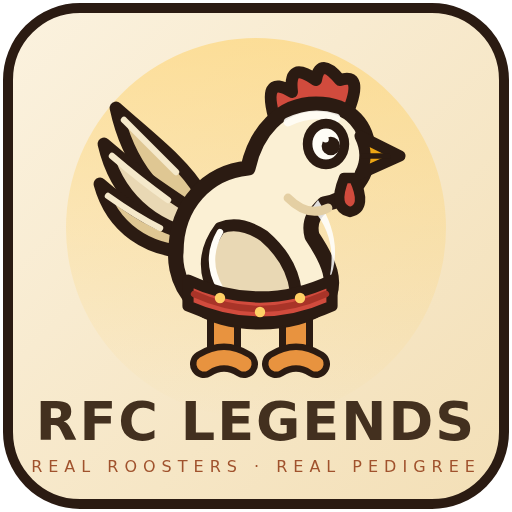
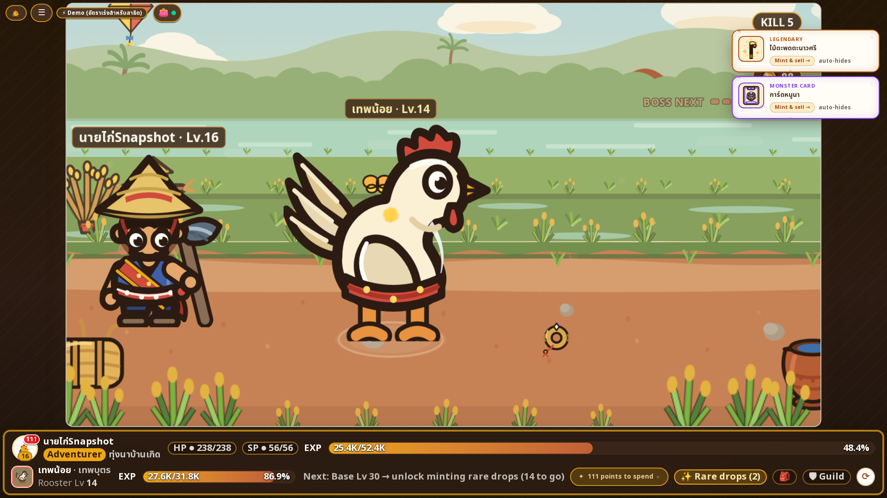
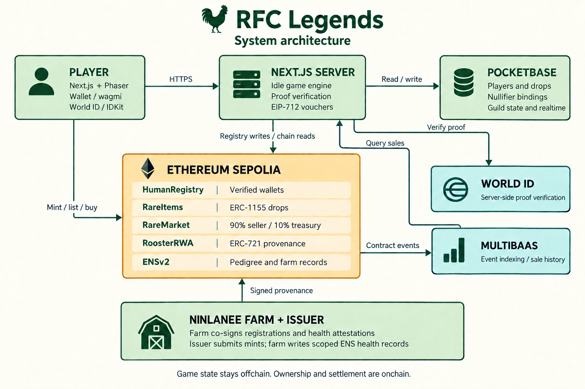
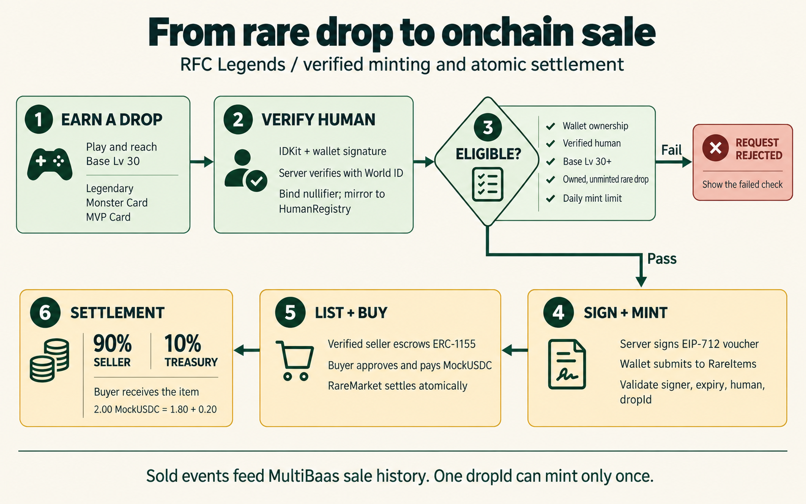
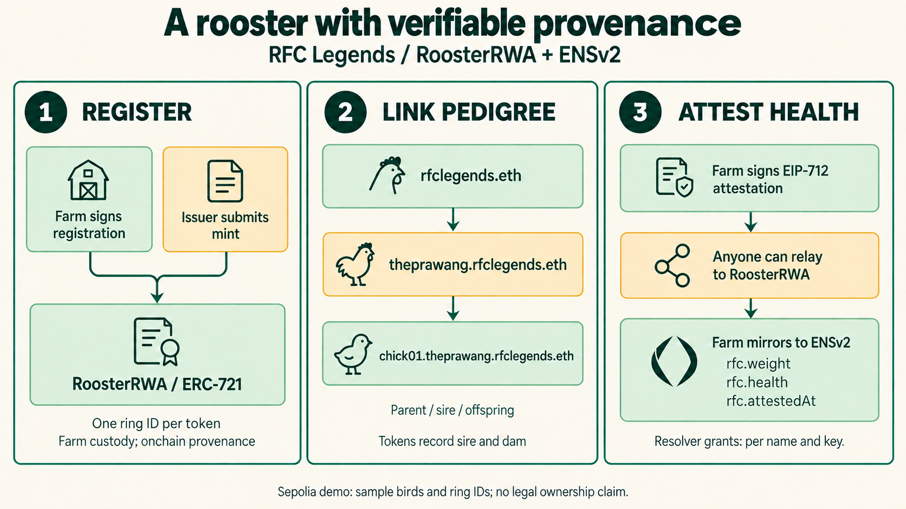

<p align="center">
  
</p>

# RFC Legends

**An idle adventure with a rooster companion, human-verified rare drops, and farm-signed pedigree.**

RFC Legends combines a Thai-themed idle RPG with an onchain rare-item economy and a rooster provenance registry. Train alongside your companion, earn drops while playing or away, and mint eligible items after World ID verification. RWA rooster cards connect farm-signed records to ERC-721 tokens and ENSv2 pedigree names.

**[Play the demo](https://rfclegends.rfcclub.app)** · [Fallback mirror](https://rfc-legends.earn.dev.rawinlab.com) · [Demo walkthrough](docs/demo-script.md) · [Contract documentation](contracts/README.md)

> **ETHGlobal Tokyo 2026 · Ethereum Sepolia.** This is a testnet prototype. The demo uses visibly labeled boosted rates, MockUSDC for settlement, and sample bird records with placeholder ring IDs. RWA tokens demonstrate provenance and pedigree; this build grants no legal claim to a physical bird.

[Overview](#what-you-can-do) · [Architecture](#architecture) · [Flows](#how-it-works) · [Integrations](#sponsor-integrations) · [Deployments](#sepolia-deployments) · [Local setup](#local-setup) · [Checks](#development-checks)

## What you can do

| Experience | Implementation |
| --- | --- |
| **Adventure and progress** | Phaser idle combat, Base/Job progression, inventory, and server-calculated offline rewards. |
| **Mint rare drops** | Legendary, Monster Card, and MVP Card drops become ERC-1155 items after wallet ownership, World ID, level, and mint-limit checks. |
| **Trade in the Rare Market** | Verified sellers escrow items; buyers pay MockUSDC. Each sale pays 90% to the seller and 10% to the treasury in one transaction. |
| **Inspect rooster provenance** | ERC-721 records, sire/offspring ENS names, farm signatures, and health attestations are visible in the rooster explorer. |
| **Play with a guild** | PocketBase stores guild chat and shared boss state, with realtime updates. |



## Architecture



| Layer | Responsibility | Source |
| --- | --- | --- |
| Browser | Next.js 16 / React 19 UI, Phaser 3 scene, wagmi wallet actions, IDKit 4 verification, and realtime subscriptions. | [Web app](apps/web/src), [game scene](apps/web/src/game/scene) |
| Application server | Calculate game progress, verify proofs and wallet signatures, enforce drop eligibility, and sign EIP-712 vouchers. | [Game engine](apps/web/src/server/game/index.ts), [World ID and vouchers](apps/web/src/server/worldid) |
| Persistence | Store players, drops, nullifier bindings, voucher limits, and guild state. Browsers access PocketBase through the app's `/pb` proxy. | [PocketBase setup](pocketbase/README.md), [migrations](pocketbase/pb_migrations) |
| Ethereum Sepolia | Enforce verified minting/listings, unique drop IDs, escrow settlement, and farm-signed rooster records. | [Solidity contracts](contracts/src) |
| Integrations | Verify human proofs with World ID; resolve pedigree through ENSv2; query indexed contract events through MultiBaas. | [ENS toolkit](ens/README.md), [MultiBaas helper](apps/web/src/lib/contracts/multibaas.ts) |

The game server determines rewards and mint eligibility. Wallets submit item mints and market transactions. `HumanRegistry` trusts the configured server attestor to mirror World ID verification; contracts independently enforce its recorded status. Market history uses MultiBaas with a direct-RPC fallback.

## How it works

### From rare drop to market sale



1. **Earn an eligible drop.** Reach Base Lv 30 and own an unminted Legendary, Monster Card, or MVP Card drop.
2. **Verify your wallet.** The server checks a wallet signature and World ID proof, binds the nullifier to one wallet, and mirrors verification to `HumanRegistry`.
3. **Request a mint voucher.** The server checks eligibility and the daily limit, then signs an EIP-712 voucher. The default limit is three distinct drops per UTC day.
4. **Mint and confirm.** The wallet calls `RareItems.mintWithVoucher`. The contract checks the signer, deadline, verified recipient, and unused `dropId`; the server confirms the `RareMinted` receipt before marking the drop minted.
5. **List and settle.** A verified seller approves and escrows the item in `RareMarket`. A buyer approves MockUSDC and buys; item delivery and the 90/10 payment split happen atomically.

World ID is required for mint recipients and sellers. Buyers can purchase without verification. The split applies to ERC-1155 sales through `RareMarket`; RoosterRWA provenance is a separate flow. Fees round down to the smallest MockUSDC unit, with the remainder going to the seller.

### From farm record to verifiable pedigree



- **Registration:** the contract owner submits a mint ([`mintRooster`](contracts/src/RoosterRWA.sol#L127)) with the farm's EIP-712 co-signature. Each ring ID can be registered once; parent tokens and hatch dates are checked onchain.
- **Pedigree:** a sire such as `theprawang.rfclegends.eth` has its own subname registry for offspring such as `chick01.theprawang.rfclegends.eth`. Token records also store sire and dam references.
- **Health records:** the farm signs weight, health score, time, and nonce. Anyone can relay a valid attestation to `RoosterRWA`; the farm separately writes `rfc.weight`, `rfc.health`, and `rfc.attestedAt` to ENS.
- **Permissions:** the hardened resolver grants health-record writes by name and key. The namespace administrator manages permissions; the farm holds the health-write grants. Physical identity and care remain the farm's responsibility.

See the [RWA trust model](contracts/README.md#trust-model) and [ENS permission model](ens/README.md#permission-model-the-load-bearing-claim).

## Sponsor integrations

These links point to the implementation entry points for review.

| Integration | What it contributes | Code pointers |
| --- | --- | --- |
| **World · IDKit** | Human proof verification, one-nullifier/one-wallet binding, and gates on rare-item minting and listings. | [Widget](apps/web/src/components/worldid/WorldIdWidget.tsx#L18), [verify UI + rejected path](apps/web/src/components/worldid/VerifyHuman.tsx#L47), [server verification](apps/web/src/server/worldid/verify.ts#L67), [voucher checks](apps/web/src/server/worldid/voucher.ts#L55), [onchain mirror](contracts/src/HumanRegistry.sol#L47), [status check](apps/web/src/app/api/worldid/status/route.ts#L8) |
| **ENS · ENSv2** | Hierarchical pedigree names and farm-scoped health records through a permissioned resolver. | [Subname registries](ens/src/ensv2.ts#L51), [resolver deployment](ens/src/ensv2.ts#L104), [registration](ens/src/ensv2.ts#L131), [record reads](apps/web/src/lib/ens/resolve.ts#L79), [attestation proof lookup](apps/web/src/lib/ens/resolve.ts#L253), [ENSv2 config](ens/src/config.ts#L22), [rooster API](apps/web/src/app/api/roosters/%5Bid%5D/route.ts#L16), [ENS records API](apps/web/src/app/api/ens/records/route.ts#L11) |
| **Curvegrid · MultiBaas** | Indexed `Sold`, `RareMinted`, `AttestationRecorded`, and `RoosterMinted` events; sale-history queries for the market UI. | [Setup script](contracts/scripts/multibaas-setup.mjs), [saved-query client](apps/web/src/lib/contracts/multibaas.ts#L91), [sales API](apps/web/src/app/api/market/sales/route.ts#L1), [RWA mint entry point](contracts/src/RoosterRWA.sol#L127) |

Integration feedback: [World ID](docs/feedback/world.md) · [Curvegrid MultiBaas](docs/feedback/multibaas.md).

## Sepolia deployments

Chain ID: **11155111**. Core addresses are recorded in [sepolia.json](contracts/deployments/sepolia.json); ENS deployment details and transaction history are in the [ENS README](ens/README.md).

| Contract | Address |
| --- | --- |
| MockUSDC | [`0x28B851fd1b0DFD6fD820FF5305e8b9D74338624C`](https://sepolia.etherscan.io/address/0x28B851fd1b0DFD6fD820FF5305e8b9D74338624C) |
| HumanRegistry | [`0x60e6d8aE3B3444f6E616634B6D8fA69FFb9619e5`](https://sepolia.etherscan.io/address/0x60e6d8aE3B3444f6E616634B6D8fA69FFb9619e5) |
| RareItems | [`0x35f5d11878F820B9fd69712Dea9387a54afD2144`](https://sepolia.etherscan.io/address/0x35f5d11878F820B9fd69712Dea9387a54afD2144) |
| RareMarket | [`0xC05Dd64c0B4e2fd1722E12B40d80044cF7963d3a`](https://sepolia.etherscan.io/address/0xC05Dd64c0B4e2fd1722E12B40d80044cF7963d3a) |
| RoosterRWA | [`0x99Cc8889b2a794071e3BC7b7aA4D3007501AB3d7`](https://sepolia.etherscan.io/address/0x99Cc8889b2a794071e3BC7b7aA4D3007501AB3d7) |
| ENSv2 permissioned resolver | [`0x225774306d9ca8c79106b1b130E26BF26e90e9Af`](https://sepolia.etherscan.io/address/0x225774306d9ca8c79106b1b130E26BF26e90e9Af) |
| ENSv2 parent subname registry | [`0x02a8349cbFee861260af5c4D1f3464B56Ec8EB70`](https://sepolia.etherscan.io/address/0x02a8349cbFee861260af5c4D1f3464B56Ec8EB70) |

<details>
<summary>Selected transaction evidence and API reads</summary>

| Evidence | Sepolia transaction |
| --- | --- |
| First recorded `HumanVerified` event | [World ID mirror](https://sepolia.etherscan.io/tx/0xa081ee7fd146ed9437061e71af91a39348a1f1c18ff28ee4985588388f0858ff) |
| Demo sale: 2.00 MockUSDC split into 1.80 / 0.20 | [Market settlement](https://sepolia.etherscan.io/tx/0xcd9b0a42baf8a9a4db9726abbb90ba17810f0cee02d7bce3801cf3d0756a6356) |
| Sale recorded in the MultiBaas integration evidence | [Second settlement](https://sepolia.etherscan.io/tx/0xfb5dccc04df2c16d291689680a1664d0c1dbb4a819c5c9f4314dd226ba106f04) |
| ENSv2 parent registration | [`rfclegends.eth`](https://sepolia.etherscan.io/tx/0x3254a5054f2a3c884ba466921e46155f30a95ad41f8a4603d4a9235f01bbbb14) |
| Farm-co-signed offspring mint; sire is token 4 | [`chick01`, token 6](https://sepolia.etherscan.io/tx/0x1957cd91e64adc39cc245a1d46424ca61fb403767986e19915d3742601f9aeea) |
| Farm-signed attestation on `theprawang` | [Weight and health attestation](https://sepolia.etherscan.io/tx/0xd4c79038486075afa7d04176945303e75432733a274d26bd70d61dc600a61ac4) |

Inspect the demo APIs:

```sh
curl -fsS 'https://rfclegends.rfcclub.app/api/market/sales'
curl -fsS 'https://rfclegends.rfcclub.app/api/ens/records?name=theprawang.rfclegends.eth'
```

The sales response reports its data source. Full mint, resolver-hardening, and attestation records are documented in [contracts](contracts/README.md) and [ENS](ens/README.md).

</details>

## Local setup

### Prerequisites

- **Node.js 22.22+ and npm** for the web app and the TypeScript demo script.
- **Foundry** (`forge`, `anvil`) for contract tests and the local chain demo.
- **Git, curl, and unzip**. The PocketBase fetch script downloads a Linux x86-64 binary; other platforms need the matching PocketBase v0.40.4 binary at `pocketbase/pocketbase`.
- **jq** if regenerating the web contract exports.

```sh
git clone --recurse-submodules https://github.com/nolifelover/rfc-legends.git
cd rfc-legends
```

For an existing clone, run `git submodule update --init --recursive`.

### 1. Start PocketBase — terminal A

From the repository root, choose local superuser credentials and keep them for the web configuration:

```sh
cd pocketbase
./fetch.sh
./pocketbase superuser upsert dev@example.com 'choose-a-local-password' --dir pb_data
./run.sh
```

PocketBase serves `http://127.0.0.1:8090`. Startup applies the checked-in migrations for game state, World ID bindings, and guild features.

### 2. Configure and start the web app — terminal B

From the repository root:

```sh
cd apps/web
npm ci
cp .env.example .env.local
```

Set these values in `.env.local`, using the credentials chosen above:

```dotenv
POCKETBASE_URL=http://127.0.0.1:8090
NEXT_PUBLIC_POCKETBASE_URL=/pb
POCKETBASE_SUPERUSER_EMAIL=dev@example.com
POCKETBASE_SUPERUSER_PASSWORD=choose-a-local-password
NEXT_PUBLIC_ENS_PARENT_NAME=rfclegends.eth
```

```sh
npm run dev
```

Open **http://localhost:3000**. The checked-in example enables demo mode. Local gameplay uses PocketBase; the full verify/mint flow also needs World ID configuration, Sepolia RPC access, and the authorized game signer below.

### 3. Configure integrations as needed

| Feature | Configuration |
| --- | --- |
| Sepolia reads and transactions | `NEXT_PUBLIC_CHAIN_ID=11155111`, `NEXT_PUBLIC_SEPOLIA_RPC_URL`, `SEPOLIA_RPC_URL`; a wallet with test ETH for transactions. |
| World ID / IDKit 4 | `NEXT_PUBLIC_WORLD_APP_ID`, `NEXT_PUBLIC_WORLD_ACTION`, `WORLD_RP_ID`, `WORLD_RP_SIGNING_KEY`, `WORLD_ENVIRONMENT`; staging additionally uses `WORLD_STAGING_VERIFICATION_TOKEN`. |
| Registry writes and mint vouchers | `GAME_SIGNER_PRIVATE_KEY` must match the deployed attestor/voucher signer and have test ETH for registry transactions. `MINT_DAILY_LIMIT` defaults to `3`. |
| Indexed sale history | `MULTIBAAS_DEPLOYMENT_URL`, `MULTIBAAS_API_KEY`; [setup script](contracts/scripts/multibaas-setup.mjs) registers contracts and saved queries. |
| Rooster explorer | `NEXT_PUBLIC_ENS_PARENT_NAME=rfclegends.eth` and Sepolia RPC access. Farm and namespace keys are used by the separate [ENS operator scripts](ens/README.md#scripts). |

Use the templates for the complete variable lists: [web](apps/web/.env.example), [contracts](contracts/.env.example), [ENS](ens/.env.example). Keep server signing keys in server-side variables. A full local deployment can use your own contract addresses and signer; an arbitrary key cannot issue valid vouchers for the recorded Sepolia deployment.

### 4. Run the contract demo on Anvil — optional

Start a local chain in a separate terminal:

```sh
anvil --port 8546
```

From the repository root, deploy to it, then run the demo:

```sh
cd contracts
forge script script/Deploy.s.sol --rpc-url http://127.0.0.1:8546 --broadcast
cd ../e2e
npm ci
npm run demo
```

Use the local defaults in a fresh shell without Sepolia signer overrides in the environment or `contracts/.env`. Deployment writes `contracts/deployments/anvil.json`, which the demo reads. The script expects Anvil to be running with contracts deployed; it does not start the node itself.

The [demo script](e2e/demo-beat.ts) checks unverified mint/list rejection, nullifier replay rejection, voucher minting, listing, purchase, and the exact 90/10 split. It calls the registry as the game attestor; exercise the browser flow to test World ID's proof verification service.

## Development checks

Run from the repository root:

```sh
# Web: unit tests, lint, type checking, and production build
(cd apps/web && npm test && npm run lint && npx tsc --noEmit && npm run build)

# Contracts: compile, test, and measure coverage
(cd contracts && forge build && forge test && forge coverage)
```

After changing contracts or deployments, regenerate the web ABIs and address map:

```sh
(cd contracts && ./scripts/export-web.sh)
```

Deployment tooling: [PM2 build and deploy](scripts/deploy.sh) · [rfctv Docker deployment](scripts/deploy-rfctv.sh) · [container and proxy configuration](deploy/rfctv). These scripts target the project's configured hosts and production environment; local development uses the steps above.

## Repository guide

| Path | Contents |
| --- | --- |
| [`apps/web/`](apps/web) | UI, game scene, server game engine, API routes, and integration clients. |
| [`contracts/`](contracts) | Solidity contracts, Foundry tests, deployment manifests, and ABI export tooling. |
| [`pocketbase/`](pocketbase) | Backend startup scripts and database migrations. |
| [`ens/`](ens) | ENSv2 registration, pedigree, permission, and attestation scripts. |
| [`e2e/`](e2e) | Contract-level demo against Anvil or Sepolia. |
| [`docs/`](docs) | [Game design](docs/RFC_Legends_GDD_v0.4.md), [interfaces](docs/interfaces.md), [demo runbook](docs/demo-runbook.md), and [submission draft](docs/ethglobal-submission-draft.md). |
| [`docs/assets/readme/`](docs/assets/readme) | Architecture and flow images, with [generation prompts](docs/assets/readme/prompts.md). |

## Team

| Member | Role | Handle |
| --- | --- | --- |
| Todsaporn Sangboon | Fullstack development | [@nolifelover](https://github.com/nolifelover) |
| Jakkarin Sanguanwong | Other | — |
| Tanabut Krinoonsingha | Other | — |

**AI tool disclosure:** Claude was used for planning, the GDD, code, and automated review passes. Codex assisted with this README revision; its built-in `image_gen` tool produced the architecture and flow illustrations in [`docs/assets/readme/`](docs/assets/readme) (exact prompts: [prompts.md](docs/assets/readme/prompts.md)). Integration feedback notes are human-reviewed.

## Project principles

- No gambling, betting, or wagering. Real-world fight results never affect cards or prices.
- Cartoon art with no blood, injury, or animal harm; the theme is Thai native breeds and transparent pedigree.
- Original names, art, and music; no Ragnarok IP.
- Premium items come from gameplay drops. No real-money gacha.
